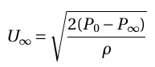

# Procedure

1. Fix the flap plate attachment and the boundary layer probe in the test section of the Airflow bench. 

2. Ensure the boundary layer probe is placed in a proper orientation, with the pitot head facing the inlet of the test section.

3. Switch on the airflow and record the pressure at the inlet and the settling chamber to estimate the flow velocity. 

4. Ensure that freestream P0 = 7.55 mbar and P∞ = 6.0 mbar.

5. With the pitot probe ensure P(y) = 6 mbar at y=0.

6. Using the micrometer, slide the boundary layer probe away from the flat plate with increments of small distances.

7. Record pressure P(y) at each increment until P(y)=7.45 mbar. See calculations for details.

8. Repeat the experiment at different intervals in the streamwise direction.

9. Record the thickness for 0.95U∞ at each streamwise position.

## Calculation:

For P0 = 7.55 mbar and P∞ = 6 mbar. We get U∞ = 15.9 m/s. Therefore, for 0.95U∞ and P∞ = 6 mbar, the cut-off for P(y) is 7.45 mbar.
