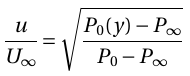

# Theory:

A boundary layer is adjacent to a surface where viscous effects are important. Figure 1 illustrates a stationary 2-D channel in a channel over a flat plate with a freestream velocity of u0. Here, fluid flows along the interior wall inside a channel with width H and a time-averaged velocity denoted as <i>u(X, Y)</i>, with X representing the flow direction and Y normal to the wall. The fluid near the wall surface has a lower velocity than the freestream. The no-slip condition enforced by the wall surface retards the flow to zero velocity, and the streamwise velocity in the direction perpendicular to the wall keeps rising until it reaches the freestream velocity. In cases where the wall-to-wall distance H is smaller than the viscous boundary layer thickness, the velocity profile u(X, Y) at X for all Y assumes a parabolic shape ue(X) in the Y-direction, with the boundary layer thickness equaling H/2. The vertical distance from the wall surface, fluid flow takes for the streamwise velocity to reach 99% of the freestream velocity is the boundary layer thickness.

 

#### Figure 1

Assume δ as the thickness where the streamwise velocity reaches 0.99u0. We know that for a point outside the boundary layer,

In the present case,  P0 (y=∞) is constant,  u(y=∞)=u is constant, P is constant, and the velocity u  varies along the vertical distance. Therefore, we can rewrite the above equation for distance along the vertical direction as 

Further,

P∞ is constant throughout the boundary layer. The total pressure can be measured using a pitot boundary layer probe. Therefore, the boundary layer displacement thickness can be estimated by replacing the velocity ratio in equations 1 with the above equation and using the Trapezoidal rule for integration.

In this experiment we measure the total pressure (P) using a pitot probe. We first measure the pressure P0 in the freestream and then measure P(y) by traversing the probe with the help of  a micrometer. We measure the boundary layer thickness at the point at which the P(y) is is equal to  P0 corresponding to 0.95U∞.

## Apparatus

- Airflow bench
- Multi-tube manometer
- Flat plate-boundary layer attachment

## Airflow bench

 

#### Figure 2

An airflow bench is a small-scale wind tunnel. It is a vertical flow, blow-down type, low-speed wind tunnel with a provision to adjust airflow. The airflow bench parts are as mentioned: blower, flow duct, flow-control valve, honeycomb section, settling chamber, contraction cone, and test section. The blower sucks air from the atmosphere and supplies it to the settling chamber through the flow duct and honeycomb section. Flow-control valve can adjust air flow to vary inlet velocity in the test section. Honeycomb reduces the turbulence coming from the blower. The contraction cone increases the velocity by reducing area at the expense of pressure. There are two pressure tapings in the air flow bench: one at the settling chamber, which gives stagnation or total pressure, and the second at the end of the contraction cone, which gives static pressure. The difference in these two pressures is used to calculate the inlet velocity of the test section.

## Multi-tube manometer
 

#### Figure 3

A multi-tube manometer is a manometer that is capable of acquiring multiple numbers of pressure values at once. During the experiment, we were required to acquire four pressure values, two from the air flow bench and two from the pitot static tube. The multi-tube manometer used in this setup is an inclined type, which allows us to increase the resolution of measurement if required.

## Flat plate- boundary layer attachment

 

#### Figure 4

It consists of a duct in which a flat plate with a smooth surface is mounted inside. The total pres-sure (and thus velocity) at various distances from the plate's leading edge is measured by a flat-tened Pitot tube positioned using a micrometer. A flexible tube connects the pitot tube to the mul-ti-tube manometer.
